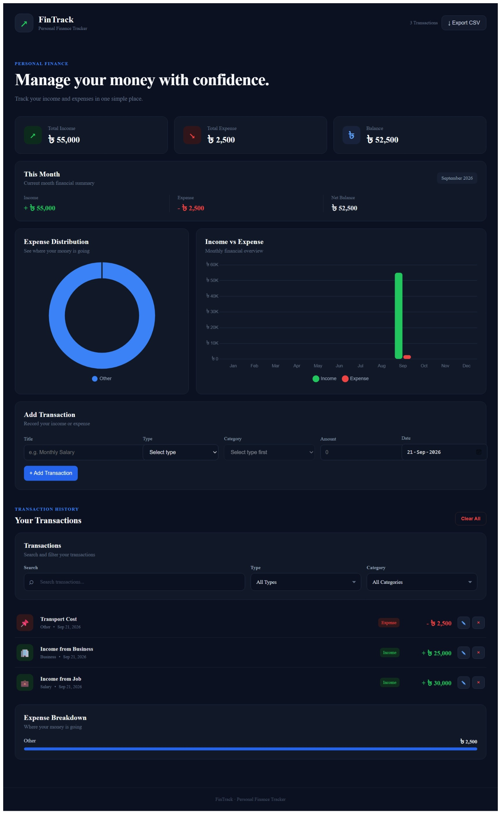

# 💰 FinTrack

A simple and modern **Personal Income & Expense Tracker** built with **Vue 3**.

FinTrack helps users track their income and expenses, monitor their balance, analyze spending, and keep their financial data saved in the browser.

## ✨ Features

- ➕ Add income and expense
- ✏️ Edit transactions
- 🗑️ Delete transactions
- 🧹 Clear all transactions
- 🔍 Search transactions
- 🔽 Filter by type and category
- 📅 Track transaction dates
- 💰 Total income, expense and balance
- 📆 Monthly financial summary
- 📊 Expense breakdown by category
- 🥧 Expense distribution chart
- 📈 Monthly income vs expense chart
- 💾 LocalStorage data persistence
- 📥 Export transactions as CSV
- 📱 Fully responsive design
- 🎨 Modern dark navy UI

## 🛠️ Tech Stack

- **Vue 3**
- **JavaScript**
- **Vite**
- **Chart.js**
- **Vue Chart.js**
- **CSS3**
- **LocalStorage**

### Vue Concepts

- Composition API
- `<script setup>`
- `ref()`
- `computed()`
- `watch()`
- `onMounted()`
- Props & Emits
- Component-based architecture

## 📂 Project Structure

    fintrack-vue/
    │
    ├── public/
    │   └── favicon.svg
    │
    ├── src/
    │   ├── assets/
    │   │   └── main.css
    │   │
    │   ├── components/
    │   │   ├── AppHeader.vue
    │   │   ├── SummaryCards.vue
    │   │   ├── MonthlySummary.vue
    │   │   ├── TransactionForm.vue
    │   │   ├── TransactionFilters.vue
    │   │   ├── TransactionList.vue
    │   │   ├── ExpenseBreakdown.vue
    │   │   └── FinanceCharts.vue
    │   │
    │   ├── App.vue
    │   └── main.js
    │
    ├── index.html
    ├── package.json
    └── README.md

## 🚀 Getting Started

### Clone the repository

    git clone https://github.com/forid1026/fintrack-vue.git

### Go to the project directory

    cd fintrack-vue

### Install dependencies

    npm install

### Start the development server

    npm run dev

Open the local URL shown in your terminal.

## 💾 Data Storage

FinTrack uses **LocalStorage** to save transactions directly in the browser.

Storage key:

    fintrack_transactions

Example transaction:

    {
      id: 123456789,
      title: "Monthly Salary",
      category: "Salary",
      amount: 40000,
      type: "income",
      date: "2026-09-21"
    }

## 📌 Categories

### Income

Salary, Freelance, Business, Investment, Bonus, Gift, Other

### Expense

Groceries, Utilities, Entertainment, Restaurants, Travel, Clothing, Healthcare, Personal, Education, Other

## 📊 Financial Summary

FinTrack provides:

- Total Income
- Total Expense
- Current Balance
- Monthly Income
- Monthly Expense
- Monthly Net Balance
- Category-wise Expense Breakdown
- Income vs Expense Charts

## 📸 Preview

Add a screenshot of the application here:

## 🎯 Purpose

FinTrack was created as a practical **Vue 3 learning and portfolio project** to practice:

- Reactive state management
- CRUD operations
- Component communication
- Form handling
- Data filtering
- LocalStorage
- Chart integration
- CSV export
- Responsive UI development

## 👨‍💻 Author

**Sheikh Farid**

Software Developer | Laravel | PHP | Vue.js | JavaScript

---

⭐ If you find this project useful, feel free to give the repository a star.